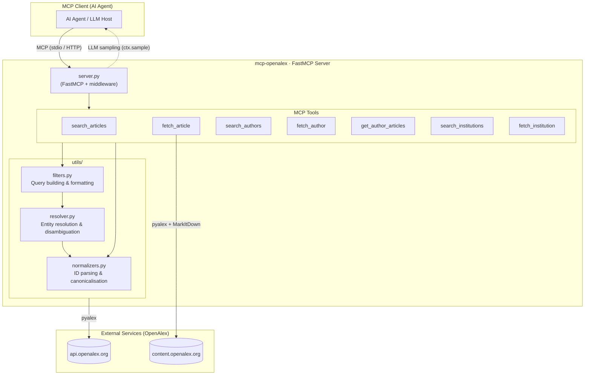
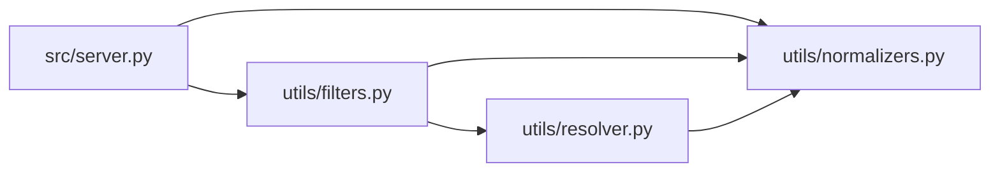
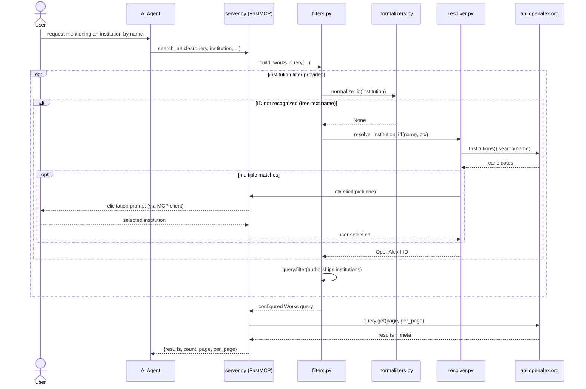
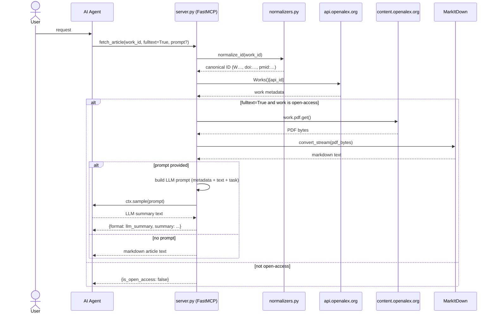

# Architecture

## System Overview

```mermaid
flowchart TD
    subgraph Client["MCP Client (AI Agent)"]
        LLM[AI Agent / LLM Host]
    end

    subgraph Server["mcp-openalex  ·  FastMCP Server"]
        SRV["server.py\n(FastMCP + middleware)"]

        subgraph Tools["MCP Tools"]
            T1[search_articles]
            T2[fetch_article]
            T3[search_authors]
            T4[fetch_author]
            T5[get_author_articles]
            T6[search_institutions]
            T7[fetch_institution]
        end

        subgraph Utils["utils/"]
            NORM[normalizers.py\nID parsing & canonicalisation]
            FILT[filters.py\nQuery building & formatting]
            RES[resolver.py\nEntity resolution & disambiguation]
        end
    end

    subgraph Ext["External Services (OpenAlex)"]
        OALEX[(api.openalex.org)]
        PDF[(content.openalex.org)]
    end

    LLM -->|"MCP (stdio / HTTP)"| SRV
    SRV --> Tools
    Tools --> NORM
    Tools --> FILT
    FILT --> RES
    RES --> NORM
    Utils -->|pyalex| OALEX
    T2 -->|"pyalex + MarkItDown"| PDF
    SRV -.->|"LLM sampling (ctx.sample)"| LLM
```

## Module Dependencies

```mermaid
flowchart LR
    server["src/server.py"]
    filters["utils/filters.py"]
    norm["utils/normalizers.py"]
    resolver["utils/resolver.py"]

    server --> norm
    server --> filters
    filters --> norm
    filters --> resolver
    resolver --> norm
```

## search_articles Flow

```mermaid
sequenceDiagram
    actor User as User
    participant Agent as AI Agent
    participant MCP as server.py (FastMCP)
    participant Filters as filters.py
    participant Norm as normalizers.py
    participant Res as resolver.py
    participant OA as api.openalex.org

    User->>Agent: request mentioning an institution by name
    Agent->>MCP: search_articles(query, institution, ...)
    MCP->>Filters: build_works_query(...)

    opt institution filter provided
        Filters->>Norm: normalize_id(institution)
        alt ID not recognized (free-text name)
            Norm-->>Filters: None
            Filters->>Res: resolve_institution_id(name, ctx)
            Res->>OA: Institutions().search(name)
            OA-->>Res: candidates
            opt multiple matches
                Res->>MCP: ctx.elicit(pick one)
                MCP-->>User: elicitation prompt (via MCP client)
                User-->>MCP: selected institution
                MCP-->>Res: user selection
            end
            Res-->>Filters: OpenAlex I-ID
        end
        Filters->>Filters: query.filter(authorships.institutions)
    end

    Filters-->>MCP: configured Works query
    MCP->>OA: query.get(page, per_page)
    OA-->>MCP: results + meta
    MCP-->>Agent: {results, count, page, per_page}
```

## fetch_article with Full-Text Flow

```mermaid
sequenceDiagram
    actor User as User
    participant Agent as AI Agent
    participant MCP as server.py (FastMCP)
    participant Norm as normalizers.py
    participant OA as api.openalex.org
    participant PDF as content.openalex.org
    participant MD as MarkItDown

    User->>Agent: request
    Agent->>MCP: fetch_article(work_id, fulltext=True, prompt?)
    MCP->>Norm: normalize_id(work_id)
    Norm-->>MCP: canonical ID (W…, doi:…, pmid:…)
    MCP->>OA: Works()[api_id]
    OA-->>MCP: work metadata

    alt fulltext=True and work is open-access
        MCP->>PDF: work.pdf.get()
        PDF-->>MCP: PDF bytes
        MCP->>MD: convert_stream(pdf_bytes)
        MD-->>MCP: markdown text

        alt prompt provided
            MCP->>MCP: build LLM prompt (metadata + text + task)
            MCP->>Agent: ctx.sample(prompt)
            Agent-->>MCP: LLM summary text
            MCP-->>Agent: {format: llm_summary, summary: ...}
        else no prompt
            MCP-->>Agent: markdown article text
        end
    else not open-access
        MCP-->>Agent: {is_open_access: false}
    end
```
