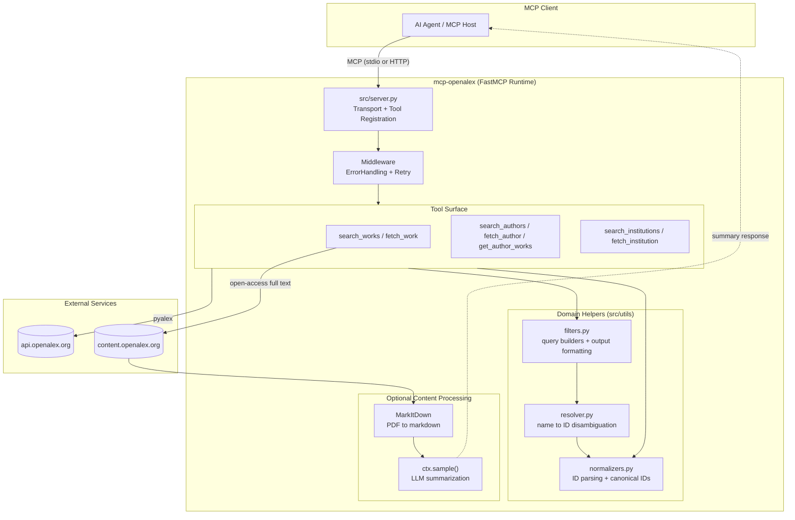
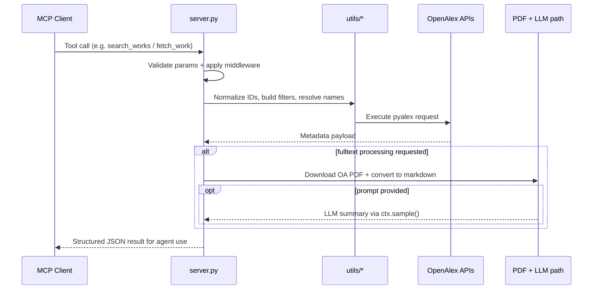
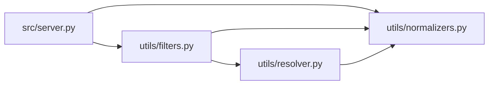

# Architecture

## System Overview

`mcp-openalex` is a FastMCP server that exposes OpenAlex data as structured, agent-friendly tools.
It supports two MCP transports (`stdio` and `http`), validates and normalizes identifiers,
builds OpenAlex queries, and optionally enriches article retrieval with PDF-to-markdown conversion
or LLM post-processing.

### Architecture at a Glance

### Request Lifecycle

### Design Characteristics

- **Transport-flexible:** same codebase runs as local `stdio` MCP server or networked `http` server.
- **Agent-centric outputs:** tools return compact, structured dictionaries tailored for LLM consumption.
- **Resilient calls:** middleware and pyalex retries reduce failures on transient OpenAlex/API issues.
- **Progressive enrichment:** expensive operations (PDF extraction, LLM summarization) are only triggered when requested.
- **Separation of concerns:** `server.py` orchestrates tools; `utils/` handles normalization, filtering, and disambiguation.

## Module Dependencies

## search_works Flow

## fetch_work with Full-Text Flow

